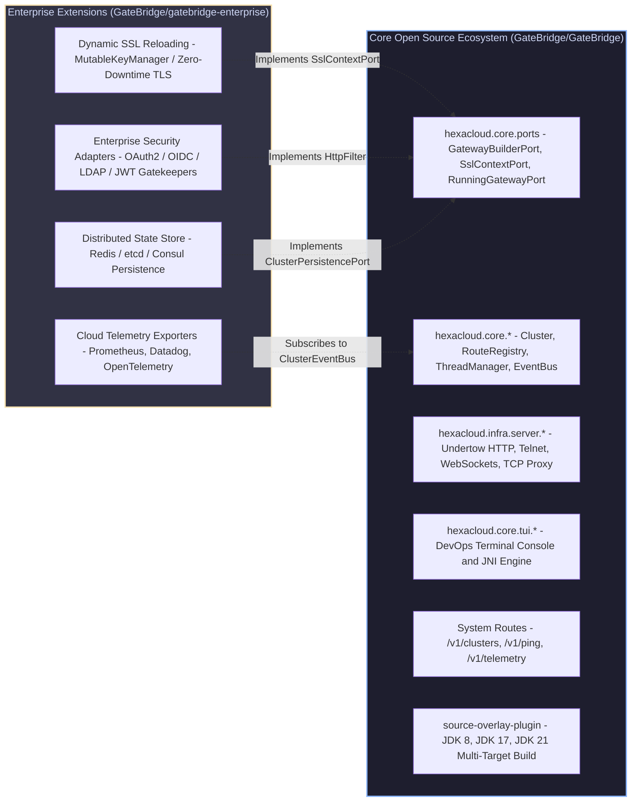
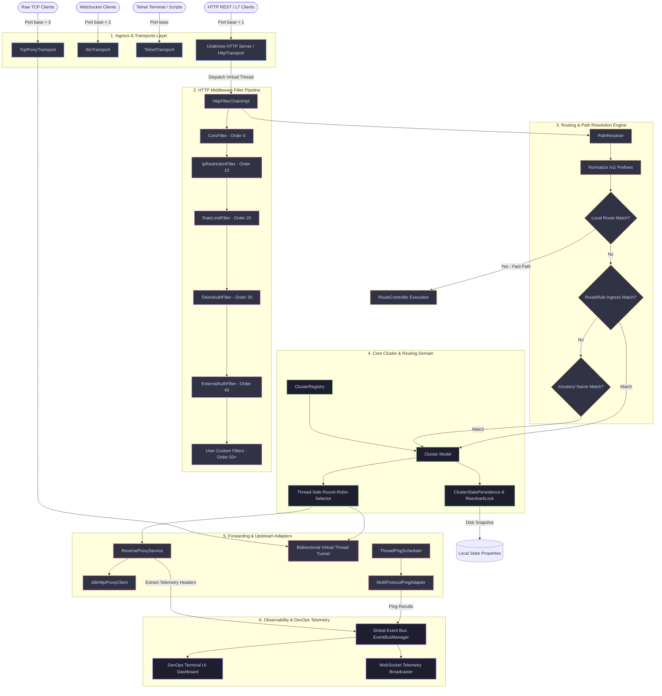
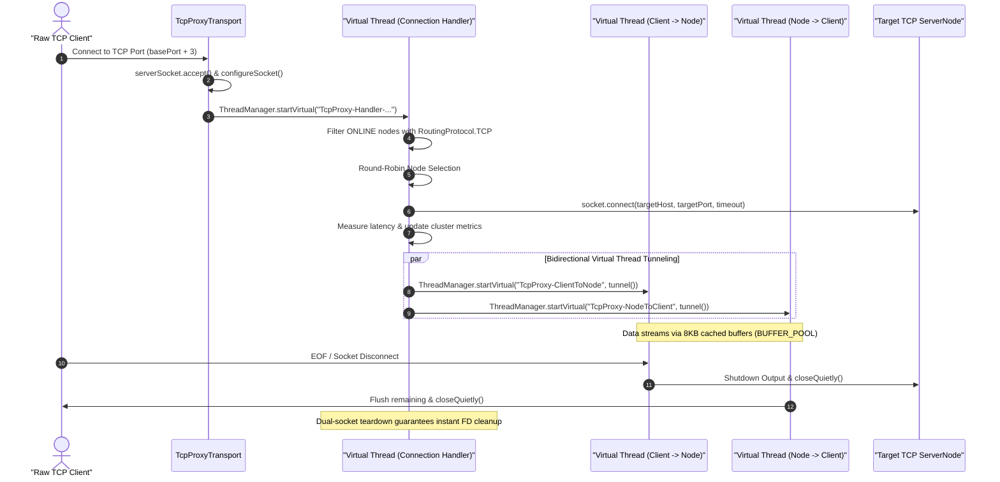
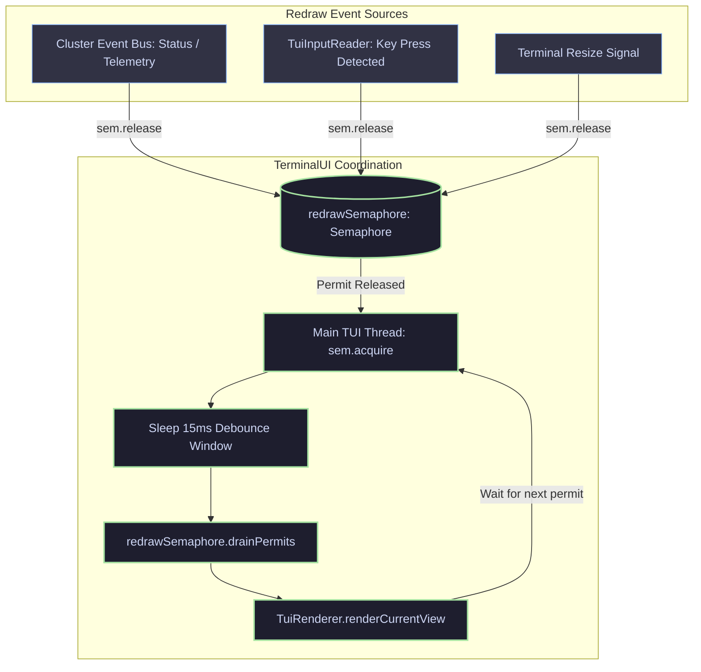
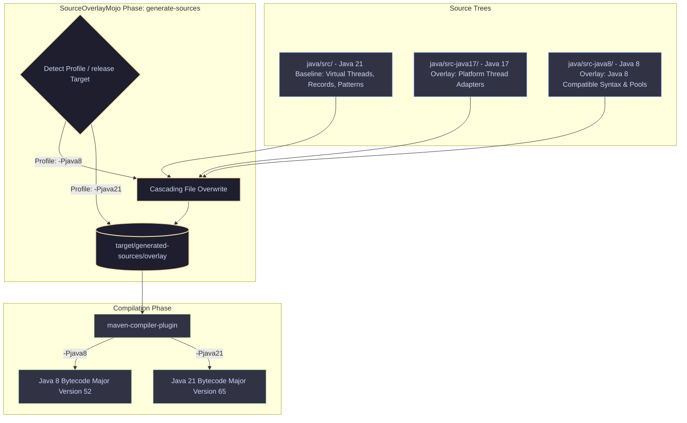

# GateBridge Core Architecture Guide

Welcome to the comprehensive architecture guide for **GateBridge**. This document provides an in-depth technical breakdown of the GateBridge gateway architecture, system components, threading models, request lifecycles, DevOps Terminal UI, multi-JDK build engine, and contributor engineering standards.

---

## Table of Contents

1. [System Overview & Engineering Philosophy](#1-system-overview--engineering-philosophy)
   - [High-Performance Lightweight Gateway](#high-performance-lightweight-gateway)
   - [Loom Concurrency vs. Legacy Thread Pools](#loom-concurrency-vs-legacy-thread-pools)
   - [Hexagonal Ports-and-Adapters Architecture](#hexagonal-ports-and-adapters-architecture)
2. [Repository & Ecosystem Topology](#2-repository--ecosystem-topology)
   - [Ecosystem Topology Diagram](#ecosystem-topology-diagram)
   - [Core Open Source Framework (`GateBridge/GateBridge`)](#core-open-source-framework-gatebridgegatebridge)
   - [Enterprise Extensions (`GateBridge/gatebridge-enterprise`)](#enterprise-extensions-gatebridgegatebridge-enterprise)
3. [Layered Architecture & Component Breakdown](#3-layered-architecture--component-breakdown)
   - [Layered System Architecture Diagram](#layered-system-architecture-diagram)
   - [Detailed Component Roles](#detailed-component-roles)
4. [Request & Connection Lifecycles](#4-request--connection-lifecycles)
   - [Layer 7 HTTP Reverse Proxy Lifecycle](#layer-7-http-reverse-proxy-lifecycle)
   - [Layer 4 Raw TCP Proxy Tunneling Lifecycle](#layer-4-raw-tcp-proxy-tunneling-lifecycle)
   - [Telnet Command Execution Lifecycle](#telnet-command-execution-lifecycle)
   - [WebSocket Real-Time Telemetry Streaming Lifecycle](#websocket-real-time-telemetry-streaming-lifecycle)
5. [Loom Virtual Threading Model (`ThreadManager`)](#5-loom-virtual-threading-model-threadmanager)
   - [Virtual Threads vs. Platform Carrier Threads](#virtual-threads-vs-platform-carrier-threads)
   - [The "Fixed 9 OS Threads" Runtime Guarantee](#the-fixed-9-os-threads-runtime-guarantee)
   - [`ThreadManager` API Reference](#threadmanager-api-reference)
   - [Loom Execution Best Practices](#loom-execution-best-practices)
6. [DevOps Terminal UI Subsystem (`hexacloud.core.tui`)](#6-devops-terminal-ui-subsystem-hexacloudcoretui)
   - [TUI Subsystem Decomposition](#tui-subsystem-decomposition)
   - [Event-Driven Screen Redraw Model](#event-driven-screen-redraw-model)
   - [Real-Time OS Thread Classification (App vs. Daemon)](#real-time-os-thread-classification-app-vs-daemon)
   - [System.out/System.err Redirection & Toggle Mode](#systemoutsystemerr-redirection--toggle-mode)
   - [Native JNI & Platform Portability Hierarchy](#native-jni--platform-portability-hierarchy)
7. [Multi-JDK Source Overlay Build System](#7-multi-jdk-source-overlay-build-system)
   - [Cascading Version Inheritance Architecture](#cascading-version-inheritance-architecture)
   - [Build Pipeline Flow](#build-pipeline-flow)
   - [Bytecode Verification](#bytecode-verification)
8. [Contributor Architecture Rules & Standards](#8-contributor-architecture-rules--standards)
   - [Zero Magic Numbers Rule](#zero-magic-numbers-rule)
   - [Non-Blocking Loom Execution Standards](#non-blocking-loom-execution-standards)
   - [Clean Port Interface Decoupling](#clean-port-interface-decoupling)
   - [Thread-Safe State Persistence Standards](#thread-safe-state-persistence-standards)
9. [Related Documentation](#9-related-documentation)

---

## 1. System Overview & Engineering Philosophy

GateBridge is an embeddable, ultra-lightweight Java cluster gateway and telemetry control plane designed to execute efficiently inside resource-constrained server instances (such as 1 vCPU instances with 512MB to 1GB RAM) while scaling to tens of thousands of concurrent client sessions.

### High-Performance Lightweight Gateway

Traditional enterprise gateways (such as Spring Cloud Gateway, Zuul, or Envoy sidecars) typically incur heavy memory footprints, extensive classloader hierarchies, complex YAML configuration engines, or platform-native C++ runtime dependencies. GateBridge delivers a zero-bloat alternative implemented in modern Java:

- **Zero Mandatory External Run-Time Frameworks**: Built without heavyweight DI containers (no Spring or Guice runtime dependencies).
- **Sub-Millisecond Startup**: Classpath auto-discovery and bootstrap complete in under 50 milliseconds.
- **Embedded & Standalone Dual-Mode**: Operates either as a packaged standalone gateway service or as an embedded dependency directly within existing Java microservices.
- **Microsecond Memory Lookups**: Configuration resolution via `EnvLoader` caches hierarchically resolved system properties, environment variables, and properties files into thread-safe memory tables.

### Loom Concurrency vs. Legacy Thread Pools

Concurrency in GateBridge is architected around **Java 21 Project Loom (Virtual Threads)** rather than legacy OS platform thread pools or reactive callback chains:

| Architecture Pattern | Memory Footprint | Complexity & Stack Traces | Context-Switch Cost |
|---|---|---|---|
| **OS Thread Pools** (Legacy Java) | ~1MB stack per thread; 1,000 threads consume ~1GB RAM | Familiar imperative code, standard stack traces | High OS kernel context-switch overhead |
| **Reactive / Async** (WebFlux, Netty) | Low memory usage; event loops share few threads | Callback hell, fragmented call stacks, difficult debugging | Low OS context-switch overhead |
| **Virtual Threads** (GateBridge Loom) | **~Few Kilobytes per thread; 100k threads consume ~200MB** | **Standard imperative code, full stack traces, zero callback hell** | **Low JVM heap continuation scheduling; 0% CPU idle** |

When a task performs a blocking operation (such as `InputStream.read()`, `Socket.connect()`, or `Thread.sleep()`), the JVM unmounts the virtual thread from its physical OS carrier thread. The carrier thread immediately executes other virtual tasks. Once the I/O event or sleep timer completes, the JVM remounts the virtual thread on an available carrier thread seamlessly.

### Hexagonal Ports-and-Adapters Architecture

GateBridge strictly enforces the **Ports-and-Adapters (Hexagonal) Architectural Pattern**. The core business domain never depends on concrete network runtimes or external third-party libraries.

```text
       +-----------------------------------------------------------+
       |                   Driving / Ingress Ports                 |
       |  GatewayBuilderPort   RunningGatewayPort   TerminalUiPort  |
       +-----------------------------+-----------------------------+
                                     |
                                     v
+------------------------------------+------------------------------------+
|                             Core Domain                                 |
|                                                                         |
|   +-------------------+  +-------------------+  +-------------------+   |
|   |      Cluster      |  |    ServerNode     |  |   RouteRegistry   |   |
|   +-------------------+  +-------------------+  +-------------------+   |
|   +-------------------+  +-------------------+  +-------------------+   |
|   | ClusterEventBus   |  |   ThreadManager   |  |   PathResolver    |   |
|   +-------------------+  +-------------------+  +-------------------+   |
+------------------------------------+------------------------------------+
                                     |
                                     v
       +-----------------------------+-----------------------------+
       |                   Driven / Egress Ports                   |
       | SslContextPort  ClusterPersistencePort  PingClientPort    |
       +-----------------------------------------------------------+
```

1. **Driving Ports (Inbound)**: Interfaces exposing gateway management and execution to applications:
   - `GatewayBuilderPort`: Fluent builder defining gateway parameters, security policies, routes, and transport toggles.
   - `RunningGatewayPort`: Runtime lifecycle management (`stop()`, dynamic node registration, scheduler interval tuning).
   - `TerminalUiPort`: Terminal UI interactive console controller.
2. **Core Domain**: Pure gateway abstractions and business invariants (`Cluster`, `ServerNode`, `RouteRegistry`, `RouteRule`, `EventBusManager`).
3. **Driven Ports (Outbound)**: SPI contracts allowing pluggable network and storage backends:
   - `SslContextPort`: TLS/SSL engine provider supporting dynamic certificate reloading.
   - `ClusterPersistencePort`: State snapshot persistence interface (default: `LocalFilePersistenceAdapter`).
   - `PingClientPort`: Health-check transport client.
   - `LogAdapterPort`: Logging bridge (default: stdout/stderr, pluggable Log4j2/SLF4J).

---

## 2. Repository & Ecosystem Topology

GateBridge is architected as an open-source core framework complemented by enterprise extensions that implement driven ports without core modifications.

### Ecosystem Topology Diagram



### Core Open Source Framework (`GateBridge/GateBridge`)

The public open-source repository provides the entire operational engine:
- **Multi-Protocol Transports**: Simultaneous Telnet, Undertow HTTP REST & L7 reverse proxy, WebSocket event streaming, and Layer 4 TCP proxy tunneling.
- **Dynamic Route Autodiscovery**: Automated reflection-based scanner identifying `@RouteMapping` controllers and `@Subscribe` event listeners.
- **System API Endpoints**: Pre-registered `/v1/*` routes providing health status, cluster metrics, and push telemetry interfaces.
- **DevOps Terminal UI**: ANSI/JNI real-time dashboard displaying system load, OS thread breakdowns, and event streams.
- **Multi-JDK Build Tooling**: Maven source overlay plugin enabling compilation across Java 8, 17, and 21.

### Enterprise Extensions (`GateBridge/gatebridge-enterprise`)

The private/enterprise repository provides enterprise-grade infrastructure adapters:
- **Dynamic TLS Hot-Reloading (`MutableKeyManager`)**: Implements `SslContextPort` to hot-swap X.509 certificates and keystores from disk or vault without dropping established client connections.
- **Cloud Telemetry Exporters**: Connects to the core `ClusterEventBusManager` to stream OpenTelemetry, Prometheus metrics, and distributed traces.
- **Distributed State Synchronization**: Implements `ClusterPersistencePort` backed by Redis or Consul for distributed multi-gateway synchronizations.

---

## 3. Layered Architecture & Component Breakdown

### Layered System Architecture Diagram



### Detailed Component Roles

| Component | Package | Primary Architectural Responsibility |
|---|---|---|
| `ServerManager` | `hexacloud.core.server` | Coordinates transport listeners, applies performance profiles, binds SSL contexts, and orchestrates lifecycle teardowns. |
| `UndertowHttpTransport` | `hexacloud.infra.server` | High-throughput Undertow HTTP server hosting REST endpoints, `/v1/*` admin APIs, and L7 reverse proxy forwarding. |
| `TcpProxyTransport` | `hexacloud.infra.server` | Layer 4 TCP proxy load-balancing raw socket streams across backend nodes with bidirectional virtual thread tunneling. |
| `TelnetTransport` | `hexacloud.infra.server` | Text-based command console for interactive administration and low-latency scripting. |
| `WsTransport` | `hexacloud.infra.server` | Real-time WebSocket push broadcaster streaming cluster status updates and telemetry metrics to clients. |
| `HttpFilterChainImpl` | `hexacloud.core.server.filter` | Ordered interceptor pipeline executing security, rate-limiting, and telemetry filters prior to route execution. |
| `PathResolver` | `hexacloud.core.server.route` | Resolves incoming URIs, normalizes `/v1/` prefixes, enforces local route precedence, and matches Ingress `RouteRule` patterns. |
| `ReverseProxyService` | `hexacloud.infra.server` | Streams HTTP requests and chunked responses between clients and upstream nodes, injecting `X-Forwarded-*` headers and harvesting passive telemetry. |
| `Cluster` | `hexacloud.core.cluster` | Aggregate root managing cluster topology, routing modes (`TELEMETRY_ONLY`, `LOAD_BALANCER_ONLY`, `HYBRID`), and thread-safe batch state persistence. |
| `ThreadPingScheduler` | `hexacloud.infra.network` | Virtual-thread-backed scheduler executing active multi-protocol health checks (`HTTP`, `WEBSOCKET`, `TCP`, `UDP`, `GRPC`). |
| `TerminalUI` | `hexacloud.core.tui` | Event-driven DevOps console with JNI terminal hooks, dynamic thread categorization, and log interception. |

---

## 4. Request & Connection Lifecycles

### Layer 7 HTTP Reverse Proxy Lifecycle

When an external client submits an HTTP request targeting an upstream cluster service:

```mermaid
sequenceDiagram
    autonumber
    actor Client as "HTTP Client"
    participant UT as UndertowHttpTransport
    participant VT as "Virtual Thread Executor"
    participant FC as HttpFilterChain
    participant PR as PathResolver
    participant C as "Cluster (Round-Robin)"
    participant RPS as ReverseProxyService
    participant Node as "Upstream ServerNode"
    participant EB as ClusterEventBusManager

    Client->>UT: HTTP GET /clusters/api-cluster/users?id=42
    Note over UT: Undertow IO Thread accepts connection
    UT->>VT: Dispatch to Virtual Thread (activeRequests <= 1500)
    VT->>FC: Execute Filter Chain (CORS -> IP -> RateLimit -> TokenAuth)
    FC->>PR: PathResolver.resolve(path, Host, RouteRegistry)
    PR-->>FC: RouteResolution (isProxy=true, cluster="api-cluster", subpath="/users")
    FC->>C: selectNode() (Overflow-safe Round-Robin)
    C-->>FC: Selected ServerNode (http://10.0.0.12:8080)
    FC->>RPS: proxyRequest(req, res, targetCluster, subpath)
    
    rect rgb(30, 30, 46)
        Note over RPS, Node: Streaming Upstream Forwarding
        RPS->>RPS: Inject X-Forwarded-For, X-Forwarded-Proto, X-Forwarded-Host
        RPS->>Node: JdkHttpProxyClient.execute(targetUrl, method, headers, bodyStream)
        Node-->>RPS: HTTP 200 OK (Transfer-Encoding: chunked, X-Telemetry-CPU: 24%)
    end

    RPS->>EB: updateTelemetryServer(cpu=24%, latency=12ms)
    RPS->>Client: Stream Response Body (8KB Bounded Buffer Pool)
    Note over RPS, Client: Connection complete - buffer recycled to pool
```



#### Step-by-Step Breakdown:
1. **Connection Ingress**: The Undertow I/O thread receives the socket connection and extracts request metadata.
2. **Virtual Thread Handoff**: If the active request count is within system limits (default max 1,500 concurrent in-flight dispatches per gateway), the request is dispatched to `virtualExecutor = ThreadManager.newVirtualThreadPool()`.
3. **Filter Pipeline Execution**: The ordered filter chain evaluates:
   - `CorsFilter` (Order 0): Handles CORS pre-flight `OPTIONS` requests immediately with status 204.
   - `IpRestrictionFilter` (Order 10): Validates client IP against comma-delimited whitelist patterns.
   - `RateLimitFilter` (Order 20): Evaluates client IP against configured request token buckets.
   - `TokenAuthFilter` (Order 30): Validates cluster secret token (`X-Cluster-Token` or query parameter) unless the target route is public or normalized under `/v1/`.
4. **Path Resolution & Routing Precedence**: `PathResolver` evaluates the request path:
   - Strips `/v1/` prefixes.
   - Checks local internal routes registered in `RouteRegistry`. Local routes take precedence to prevent Ingress wildcard shadowing.
   - Evaluates virtual host and path pattern `RouteRule` models.
   - Evaluates legacy `/clusters/{clusterName}/{path}` URIs.
5. **Round-Robin Node Selection**: `Cluster.selectNode()` executes a thread-safe, overflow-safe atomic index increment (`(roundRobinIndex.getAndIncrement() & Integer.MAX_VALUE) % onlineNodes.size()`), ignoring nodes flagged as `telemetryOnly` or `OFFLINE`.
6. **Reverse Proxy Streaming**: `ReverseProxyService` attaches `X-Forwarded-*` headers and streams the request payload upstream.
7. **Passive Telemetry Extraction**: Upstream response headers (`X-Telemetry-CPU`, `X-Telemetry-RAM`, `X-Node-CPU`, `X-Node-RAM`) and measured round-trip latency are parsed and dispatched to `ClusterEventBusManager`.
8. **Chunked Streaming Response**: The response body is transferred to the client using a bounded buffer pool (`BUFFER_POOL`), preventing heap memory spikes.

### Layer 4 Raw TCP Proxy Tunneling Lifecycle



#### Step-by-Step Breakdown:
1. **Raw Socket Ingress**: `TcpProxyTransport` accepts the client socket on `basePort + 3` and sets TCP socket options (`TCP_NODELAY = true`, `SO_KEEPALIVE = true`, `SO_TIMEOUT`).
2. **Lightweight Virtual Worker**: Spawns an isolated named virtual thread to manage backend connection negotiation without blocking the listener loop.
3. **Backend Node Selection**: Filters all online nodes configured with `RoutingProtocol.TCP` and selects an upstream node via round-robin.
4. **Latency Measurement**: Connects to the backend node and computes socket handshake latency, updating telemetry records.
5. **Bidirectional Tunneling**: Spawns two dedicated virtual threads (`TcpProxy-ClientToNode` and `TcpProxy-NodeToClient`). Each thread streams raw bytes using pooled 8KB byte buffers (`BUFFER_POOL`, capped at `MAX_POOL_SIZE = 512`).
6. **Dual-Socket Teardown**: When either side closes the connection or encounters an I/O timeout, both sockets are closed immediately, preventing leaked file descriptors.

### Telnet Command Execution Lifecycle

1. A client connects to `basePort` via raw TCP socket.
2. `TelnetTransport` spawns a virtual thread reading line-by-line input commands (`CRLF` terminated).
3. The command string is split into route name and arguments.
4. `RouteRegistry` looks up the mapped `RouteController` method and executes it, streaming output back to the client via `PrintWriter`.

### WebSocket Real-Time Telemetry Streaming Lifecycle

1. Clients establish a WebSocket handshake on `basePort + 2`.
2. `WsTransport` registers active WebSocket channels in a thread-safe set.
3. When cluster events (`NodeStatusChanged`, `NodeTelemetryUpdated`, `NodeEventSubmitted`) are published to the global event bus, a background virtual thread serializes the event payload into JSON and broadcasts it concurrently to all active WebSocket sessions.

---

## 5. Loom Virtual Threading Model (`ThreadManager`)

### Virtual Threads vs. Platform Carrier Threads

Project Loom introduces **Virtual Threads** (managed entirely in heap memory by the Java Virtual Machine) running on top of a small pool of **Platform Carrier Threads** (managed by the operating system kernel).

```text
+-----------------------------------------------------------------------+
|                       JVM Heap Virtual Threads                        |
|  [HTTP Worker 1]   [HTTP Worker 2]   [TCP Tunnel 1]   [Ping Worker]   |
|  [HTTP Worker 3]   [HTTP Worker 4]   [TCP Tunnel 2]   [Event Worker]  |
|         |                 |                 |                 |       |
|         v                 v                 v                 v       |
|   (Unmounts on I/O) (Mounts on Run)  (Unmounts on I/O) (0% CPU Sleep) |
+-----------------------------------------------------------------------+
                                    |
                                    v
+-----------------------------------------------------------------------+
|                     OS Platform Carrier Threads                       |
|           [ForkJoinPool-1-worker-1]    [ForkJoinPool-1-worker-2]      |
|           [ForkJoinPool-1-worker-3]    [ForkJoinPool-1-worker-4]      |
+-----------------------------------------------------------------------+
```

### The "Fixed 9 OS Threads" Runtime Guarantee

In standard deployment benchmarks, GateBridge maintains a deterministic OS platform thread footprint. Even when serving hundreds of active WebSocket connections, scheduling dozens of node health checks, and proxying HTTP traffic, the operating system thread monitor reveals **exactly 9 OS platform threads**:

```text
Total OS Threads: 9
├── Base JVM Runtime Threads (6)
│   ├── main (JVM bootstrap thread)
│   ├── Reference Handler
│   ├── Finalizer
│   ├── Signal Dispatcher
│   ├── Common-Cleaner
│   └── Notification Thread
└── Loom Infrastructure Carrier Threads (3)
    ├── ForkJoinPool-1-worker-1      (Executes virtual tasks)
    ├── ForkJoinPool-1-delayScheduler (Maintains virtual thread sleep timers)
    └── VirtualThread-unblocker      (Wakes virtual threads on I/O readiness)
```

Because all application tasks, network workers, and scheduled health pings are executed on virtual threads, **the total count of OS threads does not grow with traffic load**.

### `ThreadManager` API Reference

All concurrency throughout GateBridge is routed through the centralized utility `ThreadManager` (`hexacloud.core.utils.concurrent.ThreadManager`):

```java
package hexacloud.core.utils.concurrent;

public class ThreadManager {

    // Spawns an anonymous virtual thread
    public static Thread startVirtual(Runnable task);

    // Spawns a named virtual thread for observability
    public static Thread startVirtual(String name, Runnable task);

    // Creates an unbounded virtual thread executor (one thread per task)
    public static ExecutorService newVirtualThreadPool();

    // Creates a virtual thread factory with a naming prefix
    public static ThreadFactory virtualThreadFactory(String namePrefix);

    // Creates a virtual-thread-backed scheduled executor
    public static ScheduledExecutorService newScheduledThreadPool(int corePoolSize, String namePrefix);

    // Low-overhead busy-wait hint to the JVM
    public static void spinWait();
}
```

#### Key Implementation Details:
- **Scheduled Virtual Executor**: `ThreadManager.newScheduledThreadPool()` constructs a `ScheduledThreadPoolExecutor` whose internal thread factory produces virtual threads via `Thread.ofVirtual().name(namePrefix, 0).factory()`. When a scheduled task executes `Thread.sleep()` or pauses between polling intervals, **the physical carrier thread is immediately released**, reducing CPU idle consumption to `0.0%`.
- **Per-Task Virtual Thread Pool**: `ThreadManager.newVirtualThreadPool()` delegates to `Executors.newVirtualThreadPerTaskExecutor()`, providing instantaneous task dispatch without task queuing bottlenecks or thread exhaustion exceptions.

### Loom Execution Best Practices

1. **Avoid Carrier Thread Pinning**:
   - **Never synchronize on long-running I/O**: In Java 21, executing a blocking native call or a blocking operation inside a `synchronized (lock)` block pins the virtual thread to its OS carrier thread.
   - **Use `ReentrantLock`**: Replace `synchronized` blocks with `java.util.concurrent.locks.ReentrantLock` for locks spanning I/O boundaries.
2. **Always Name Virtual Threads**:
   - Always supply descriptive names when calling `ThreadManager.startVirtual("TcpProxy-Worker", runnable)`. Named virtual threads appear clearly in thread dumps and APM profilers.
3. **Do Not Pool Virtual Threads**:
   - Never use bounded thread pool sizes (e.g. `Executors.newFixedThreadPool(50)`) for virtual threads. Virtual threads are designed to be created on demand and discarded after execution.

---

## 6. DevOps Terminal UI Subsystem (`hexacloud.core.tui`)

The DevOps Terminal UI is an interactive, ANSI-driven dashboard providing real-time telemetry, live thread categorization, cluster configuration, and log inspection directly from the terminal console.

```text
+=============================================================================+
| GateBridge Control Plane [DevOps Console]                Status: ONLINE     |
+=============================================================================+
| Memory: 42MB / 512MB [====------------------------] 8.2%                    |
| OS Threads: 9 (App: 1, Daemon: 8)    Virtual Tasks: Active                  |
| Active Clusters: 2                   Registered Nodes: 6 (Online: 5)        |
+-----------------------------------------------------------------------------+
| CLUSTERS [Tab to focus]               | SERVICES [api-cluster]              |
| > api-cluster (HYBRID) [Port: 3000]   | * node-1 (http://10.0.0.1:8080) OK  |
|   auth-cluster (TELEMETRY) [Port:3010]| * node-2 (http://10.0.0.2:8080) OK  |
|                                       | * node-3 (http://10.0.0.3:8080) OFF |
+-----------------------------------------------------------------------------+
| RECENT EVENTS                                                               |
| [2s ago] NodeTelemetryUpdated: node-1 (CPU: 18%, RAM: 34%, Latency: 4ms)   |
| [14s ago] NodeStatusChanged: node-3 (ONLINE -> OFFLINE)                    |
+-----------------------------------------------------------------------------+
| [TAB] Switch Focus  [ENTER] Inspect  [G] Gateway Setup  [Q] Detach/Exit     |
+=============================================================================+
```

### TUI Subsystem Decomposition

The TUI subsystem is modularly partitioned into isolated components:

```text
hexacloud.core.tui
├── TerminalUI.java              -> Main coordinator, life cycle & semaphore loop
├── TerminalUiFactory.java       -> Fluent builder configuring TUI permissions
├── TuiState.java                -> View state, active focus, cursor positions
├── TuiRenderer.java             -> Canvas renderer, border drawing, ANSI styling
├── TuiKeyHandler.java           -> Keycode dispatcher (arrows, enter, shortcuts)
├── TuiPrompts.java              -> Interactive dialog modals (suspends raw mode)
├── TuiConstants.java            -> ANSI colors, panel focus IDs, refresh delays
└── view
    ├── DashboardViewRenderer.java    -> Primary 2-column cluster/node dashboard
    ├── ClusterDetailViewRenderer.java -> Detailed node inspection & config
    ├── NodeConfigViewRenderer.java   -> Ping path, token headers, protocols
    └── FullLogsViewRenderer.java     -> Scrollable system logs viewer
```

### Event-Driven Screen Redraw Model

Unlike conventional console applications that run tight, CPU-burning rendering loops (e.g. refreshing every 100ms regardless of changes), the GateBridge TUI is **100% event-driven**:



1. **Zero-CPU Idle Sleep**: The main rendering thread blocks on `redrawSemaphore.acquire()`. When no user inputs or cluster events occur, **CPU utilization is 0.0%**.
2. **Keyboard Polling Worker**: A lightweight virtual thread (`TuiInputReader`) polls keyboard input every 50ms using `NativeTerminal.readKey()`. When a keystroke occurs, it modifies `TuiState` and calls `redrawSemaphore.release()`.
3. **Redraw Coalescing & Debouncing**: When multiple events fire simultaneously (e.g., 50 node ping responses arriving together), the main loop wakes up, sleeps for 15ms, drains all accumulated permits (`redrawSemaphore.drainPermits()`), and executes **a single clean screen render**, preventing terminal visual flickering.

### Real-Time OS Thread Classification (App vs. Daemon)

The TUI dashboard actively interrogates the JVM `ThreadMXBean` to classify threads into distinct categories:
- **Application OS Threads**: User-created platform threads executing business logic.
- **Daemon OS Threads**: Internal JVM threads (GC workers, signal handlers, finalizers).
- **Metric Formula**: Displays `OS Threads: total (App: total - daemon, Daemon: daemon)`.

This provides real-time visibility into thread leakage and confirms that Loom virtual tasks do not spawn unmanaged platform threads.

### System.out/System.err Redirection & Toggle Mode

- **Stream Hijacking (`redirectSystemOut = true`)**: `PrintStreamFactory` wraps `System.out` and `System.err` in a thread-safe circular ring buffer. Log outputs are routed into the TUI log panel rather than corrupting the interactive terminal canvas.
- **Detachable Toggle Mode (`startToggleMode()`)**:
  - Bootstraps gateways in the background while printing regular log lines to stdout.
  - Pressing `ENTER` or `M` attaches the interactive full-screen TUI immediately.
  - Pressing `Q` or `ESC` detaches the TUI, restoring terminal canonical mode without interrupting running gateways or terminating the JVM.

### Native JNI & Platform Portability Hierarchy

The TUI keystroke reading and cursor rendering utilizes a 3-tier fallback hierarchy:

```text
Tier 1: Native JNI Mode (libhexaterminal.so / .dylib / .dll)
   │  Direct OS ioctl / tcsetattr / GetConsoleScreenBufferInfo calls
   ▼ (If native library missing)
Tier 2: Pure Java stty Fallback (Unix / Linux / macOS)
   │  Spawns background process: "stty raw -echo < /dev/tty"
   ▼ (If not on Unix or stty unavailable)
Tier 3: ANSI Emulation Fallback (Windows / Headless CI)
      Standard System.in line buffer & standard ANSI escape sequences
```

Developers can configure custom JNI libraries via JVM arguments (`-Dgatebridge.jni.path=/path/to/libhexaterminal.so`), environment variables (`GATEBRIDGE_JNI_PATH`), or programmatic invocation (`NativeTerminal.loadJni(...)`).

---

## 7. Multi-JDK Source Overlay Build System

GateBridge provides native support for Java 21, Java 17, and legacy Java 8 deployments using a single unified Git codebase.

### Cascading Version Inheritance Architecture

Rather than maintaining separate long-lived git branches for each Java version (which leads to code drift and cherry-picking overhead), GateBridge uses the custom **Maven Source Overlay Plugin** (`source-overlay-plugin`):



### Build Pipeline Flow

1. **Java 21 Baseline (`java/src/`)**: The main codebase leverages modern Java 21 features (Virtual Threads, `Thread.ofVirtual()`, pattern matching, record types).
2. **Java 8 Overlay (`java/src-java8/`)**: Contains targeted class replacements (such as `ThreadManager.java` utilizing standard `ThreadPoolExecutor` or replacing records with standard POJO classes).
3. **Execution Phase**:
   - `SourceOverlayMojo` executes during the `generate-sources` phase.
   - When `-Pjava8` is active, it copies `java/src/` to `target/generated-sources/overlay`, then overlays `java/src-java17/` and `java/src-java8/` sequentially.
   - The Maven compiler compiles from the generated overlay folder.
4. **CI/CD Matrix Deployment**:
   - Pushes to the `build` branch trigger `.github/workflows/build.yml`.
   - Parallel matrix jobs build `-Pjava8` and `-Pjava21` artifacts.
   - Automatic Git tags (`1.0.x-beta-jdk8` and `1.0.x-beta-jdk21`) are created and pushed to JitPack.

### Bytecode Verification

Bytecode compatibility can be verified directly using `javap`:

```bash
# Verify Java 8 compilation produces Major Version 52
javap -v target/classes/hexacloud/core/utils/concurrent/ThreadManager.class | grep "major version"
# Output: major version: 52

# Verify Java 21 compilation produces Major Version 65
javap -v target/classes/hexacloud/core/utils/concurrent/ThreadManager.class | grep "major version"
# Output: major version: 65
```

For complete build pipeline documentation, refer to the [Multi-JDK Build Workflow Guide](build-workflow.md).

---

## 8. Contributor Architecture Rules & Standards

To maintain framework performance, memory boundaries, and cross-JDK portability, all contributors must adhere to the following core architectural rules:

### Zero Magic Numbers Rule

Hardcoded numeric literals and literal string escape sequences are strictly prohibited in business and transport logic:
1. **Network & System Constants**: All default ports, offsets, timeouts, socket backlog depths, buffer sizes, and memory limits must be defined in `hexacloud.core.config.ClusterConfig`:
   ```java
   // FORBIDDEN:
   serverSocket = new ServerSocket(3000);
   byte[] buffer = new byte[8192];

   // REQUIRED:
   serverSocket = new ServerSocket(ClusterConfig.DEFAULT_SERVER_PORT);
   byte[] buffer = new byte[ClusterConfig.DEFAULT_BUFFER_SIZE];
   ```
2. **UI & ANSI Constants**: All terminal colors, panel focus identifiers, view indexes, and rendering loop delays must be defined in `hexacloud.core.tui.TuiConstants`:
   ```java
   // FORBIDDEN:
   System.out.print("\033[32m");

   // REQUIRED:
   System.out.print(TuiConstants.GREEN);
   ```

### Non-Blocking Loom Execution Standards

1. **Virtual Thread Utility Usage**: Never invoke `new Thread(...)` or manual OS thread factories for background tasks. Always use `ThreadManager.startVirtual("WorkerName", runnable)`.
2. **No Synchronized I/O Locks**: Never use `synchronized` keyword blocks around network I/O, socket reads/writes, or sleep operations to prevent carrier thread pinning. Use `ReentrantLock` or atomic primitives (`AtomicInteger`, `AtomicReference`).
3. **Bounded Memory Allocation**: All byte buffers used for proxy streaming must use bounded pools (such as `ReverseProxyService.BUFFER_POOL` and `TcpProxyTransport.BUFFER_POOL`) to prevent Out-Of-Memory errors during high-throughput bursts.

### Clean Port Interface Decoupling

1. **Package Dependency Hierarchy**:
   - `hexacloud.core.*` classes MUST NEVER import from `hexacloud.infra.*`.
   - Core domain models must interact with network infrastructure exclusively through interfaces defined in `hexacloud.core.ports.*`.
2. **Interchangeable Adapters**: Transports must be completely decoupled from domain controllers. A `RouteController` must function identically regardless of whether the incoming request arrived via Telnet, Undertow HTTP, or raw TCP.

### Thread-Safe State Persistence Standards

1. **Batch Persistence Mode**: When mutating multiple nodes or clusters in sequence, always acquire the cluster `ReentrantLock` and enable batch mode (`batchMode = true`) to prevent repetitive disk I/O flushes:
   ```java
   cluster.lock();
   try {
       cluster.setBatchMode(true);
       // Mutate multiple nodes in memory
   } finally {
       cluster.setBatchMode(false);
       cluster.saveState(); // Commit single O(1) batch write to disk
       cluster.unlock();
   }
   ```
2. **Secret Exclusion**: Never serialize sensitive credentials, tokens, or private keys to `.state/*.properties` disk files. Secrets are runtime-only and must be supplied via environment variables, code configuration, or external vaults.

---

## 9. Related Documentation

For specialized configuration guides, contract specifications, and component manuals, refer to the following documents:

- [Gateway Configuration & Usage Guide](gateway.md) — Configuring gateways, Ingress route rules, L7/L4 load balancing, and persistence.
- [Concurrency & ThreadManager API](thread-manager.md) — Comprehensive guide to Loom virtual threading and scheduling.
- [DevOps Terminal UI Guide](terminal-ui.md) — Navigation, shortcuts, JNI setup, and headless modes.
- [Event-Driven TUI Architecture](event-driven-tui.md) — Deep dive into semaphore-driven rendering and event propagation.
- [Custom Events API](events.md) — Typed event records, `@Subscribe` handlers, and global interceptors.
- [Framework Extensibility & Filters](framework-extensibility.md) — Custom HTTP filter chain, `@Order`, and route controllers.
- [Logging Subsystem & Adapters](logging.md) — Log redirection, TUI logging ring buffers, and custom adapters.
- [Health Check API Contracts](ping-api-contract.md) — Telemetry formats and multi-protocol ping contracts.
- [Multi-JDK Build Workflow](build-workflow.md) — Matrix builds, source overlay plugin, and JitPack release pipelines.
- [Showcase Examples](examples.md) — Practical bootstrap patterns and complete application samples.
- [Contribution Guidelines](../CONTRIBUTING.md) — Code style, pull request guidelines, and workflow standards.
- [Branching Strategy](../BRANCHING.md) — Branch naming, commit conventions, and release procedures.
